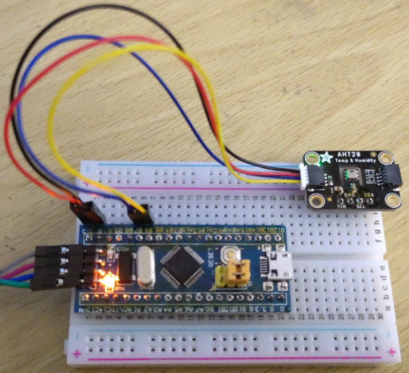

# AHT20-driver

[](https://crates.io/crates/aht20-driver)
[](https://crates.io/crates/aht20-driver)
[](https://docs.rs/aht20-driver)

Rust embedded-HAL driver for the AHT20 temperature and humidity sensor.



You can read my blog post [AHT20 thermometer
driver](http://www.rawmeat.org/code/20220130-aht20_driver/) which details the
creation of this driver.


## Example

There is an example app for the Blue Pill board in the
[examples/blue_pill/](examples/blue_pill/) directory. You can run that with
`cargo run --release`. It will read the temperature and humidity and print it
the console.


## How to use

Using the AHT20 driver in your own project should be possible with any platform
that supports the
[embedded-HAL](https://github.com/rust-embedded/embedded-hal). See
[awesome-embedded-rust](https://github.com/rust-embedded/awesome-embedded-rust#hal-implementation-crates)
for a list of supported platforms. I've used this driver with the
[stm32f103](https://github.com/stm32-rs/stm32f1xx-hal), aka. the Blue Pill
board.

In order to use the `aht20-driver` you'll need to configure an I2C device that
implements the [embedded HAL blocking
I2C](https://docs.rs/embedded-hal/latest/embedded_hal/blocking/i2c/index.html)
traits. You'll also need a delay device that implements the [embedded HAL
blocking delay
traits](https://docs.rs/embedded-hal/latest/embedded_hal/blocking/delay/index.html).

The example in this repository shows an example for the Blue Pill board. Once
you have those configured - pass those to the `AHT20::new` method to create the
device driver. You will need to call the `init` method on it, which will
calibrate the sensor and return a new struct with methods for measuring and
resetting the sensor.

Once calibrated you can call the `measure` method which will return a
measurement containing temperature and humidity values in relative humidity %,
and degrees Celsius.
 
```rust 
// Configure the AHT20 temperature and humidity sensor.
let mut aht20_uninit = aht20_driver::AHT20::new(i2c, aht20_driver::SENSOR_ADDRESS);
let mut aht20 = aht20_uninit.init(&mut delay).unwrap();

// Take the temperature and humidity measurement.
let aht20_measurement = aht20.measure(&mut delay).unwrap();

rprintln!("temperature (aht20): {:.2}C", aht20_measurement.temperature);
rprintln!("humidity (aht20): {:.2}%", aht20_measurement.humidity);
```

### No floating point support

There is an alternative measuring function called `measure_no_fp` which also
performs a measurement, but which does not require floating point calculations.
This can be good for microcontrollers with limited amounts of RAM, or no
floating point support. This can both make the binary smaller, and the
calculations faster for those microcontrollers. The trade-off is that the
accuracy is limited - only round numbers are returned from this function.


## Contributing

Please open an issue, start a conversation under discussions, or submit a pull
request - all are welcome.

I'd love to know if you're using the driver, and I'd like to link to your
projects so that others can learn from them.


## License

`aht20-driver` is distributed under the terms of both the MIT License and the
Apache License 2.0.

See the [LICENSE-APACHE](LICENSE-APACHE) and [LICENSE-MIT](LICENSE-MIT) files
for license details.
