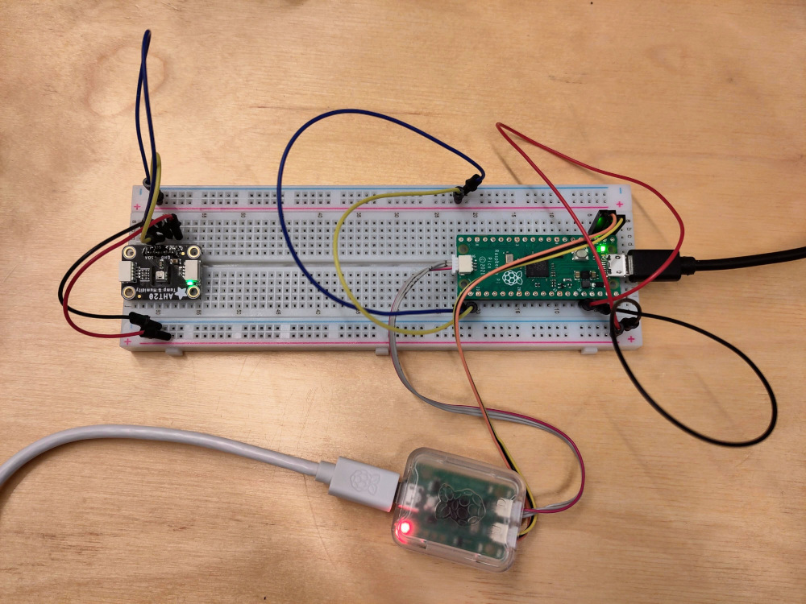
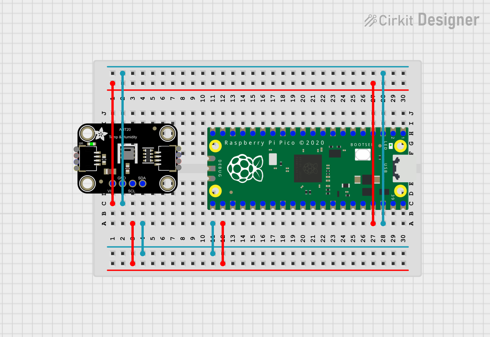

# Using the AHT20 with a Raspberry Pi Pico






This example relies on running the example using a debug probe, such as the
[Raspberry Pi debug
probe](https://www.raspberrypi.com/documentation/microcontrollers/debug-probe.html).
The example uses [probe-rs](https://probe.rs/) to flash your Rasbperry Pi Pico
and to get defmt log messages transmitted and displayed. If you have your probe
set up and connected, then all you need to run this example is to run:

```
DEFMT_LOG=info cargo run
```

You should then start to get output like:

```
INFO  setup done
└─ aht20_rp_pico_example::__cortex_m_rt_main @ src/main.rs:106
INFO  temperature: 22.808838
└─ aht20_rp_pico_example::__cortex_m_rt_main @ src/main.rs:116
INFO  humidity: 50.65298
└─ aht20_rp_pico_example::__cortex_m_rt_main @ src/main.rs:117
```
